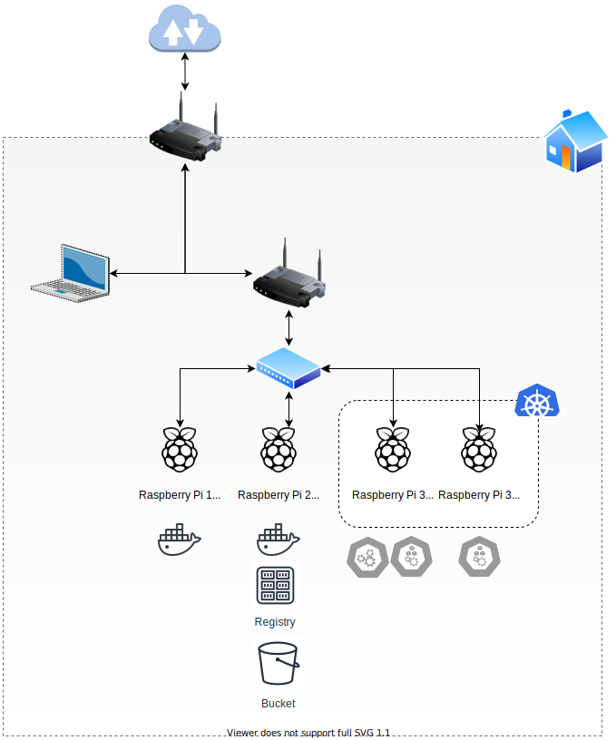

# Raspberry Pi @ Home

## Uso de cada Raspberry Pi

> Work in Progress

### Raspberry Pi 1 (arm v6.1)

> To be defined

- Docker 20 instalado

### Raspberry Pi 2 (arm v7.1)

Inicialmente, la idea era usar la RPi2 como un nodo del clúster de Kubernetes. Pero como no es posible desplegar Ansible como contenedor en la RPi1, he pensado en usar la RPi2 como *control machine*.

Dado que, como *control machine* de Ansible la RPi2 estará inactiva la mayor parte del tiempo, he pensado en desplegar otros servicios como un Registry de imágenes, un servidor de [MinIO](https://min.io/) (en modo *standalone*), un servidor Git con Gitea, etc...

### Raspberry Pi 3 (arm v7.1)

Las dos Raspberry Pi 3 forman un clúster de Kubernetes basado en [K3s](https://k3s.io/) [^nodocker].

Uno de los nodos (RPi31) asumirá el rol de *control plane* (además de *worker*). K3s permite el despliegue de *workloads* en los nodos del *control plane*, así que el clúster tendrá dos nodos *worker*, uno *dedicado* y otro compartido con el nodo de *control plane*.

## Diagrama del laboratorio

El código fuente del diagrama se encuentra en [`diagrams-src/lab-raspberry-pi.drawio`](diagrams-src/lab-raspberry-pi.drawio) y puede editarse en [Draw.io](https://draw.io).

[^nodocker]: K3s usa `containerd` por defecto como *container runtime*, por lo que no es necesario instalar Docker en las Raspberry Pi 3. K3s puede, opcionalmente, usar Docker: [K3s - Using Docker as the Container Runtime](https://rancher.com/docs/k3s/latest/en/advanced/#using-docker-as-the-container-runtime)
